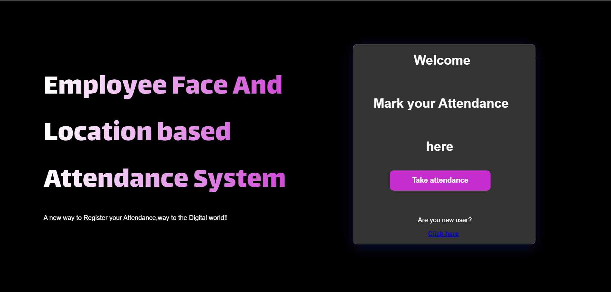

I'll take a look at the file and then create a `README.md` based on its contents. Let's review the file.

Based on the content of your `app.py` file, here’s a draft for your `README.md` file:

---

# Employee Face and Location Based Attendance System

## Overview

This system is designed to streamline employee attendance tracking by using facial recognition and location verification. Built with Flask and integrated with Google Sheets for data management, it ensures accurate recording of employee check-ins and check-outs based on both face recognition and geolocation.

## Features

- **Facial Recognition**: Uses OpenCV's `CascadeClassifier` for face detection to verify employee identity.
- **Location Verification**: Utilizes GPS data to confirm the employee's location during attendance marking.
- **Google Sheets Integration**: Attendance data is stored in a Google Sheets document for easy access and management.
- **Flask-Based Web Application**: The system is built on Flask, making it lightweight and easy to deploy.

## Requirements

- Python 3.x
- Flask
- OpenCV
- NumPy
- scikit-learn
- pandas
- joblib
- gspread
- oauth2client
- geopy

## Installation

1. **Clone the repository:**

   ```bash
   git clone https://github.com/your-repo/employee-attendance-system.git
   cd employee-attendance-system
   ```

2. **Install the required Python packages:**

   ```bash
   pip install -r requirements.txt
   ```

3. **Set up Google Sheets API:**

   - Download your credentials JSON file from Google Cloud Console.
   - Place the credentials file in the project directory and update the path in the `app.py` file.

4. **Run the Flask application:**

   ```bash
   python app.py
   ```

## Usage

- **Starting the System:**
  - Run the Flask application as described above.
  - Access the web interface at `http://127.0.0.1:5000/` in your browser.

- **Employee Check-In/Check-Out:**
  - The system captures the employee's face and checks the GPS location.
  - Attendance data is automatically recorded in the linked Google Sheets document.

## Configuration

- **Face Detection Configuration:**
  - The face detection model is loaded from a Haar Cascade XML file. You can update the path in `app.py` if necessary.

- **Location Configuration:**
  - The application uses the Google Maps Geocoding API for location verification. Ensure that your API key is correctly set in the `app.py` file.

## Contributing

Feel free to contribute to this project by creating a pull request or submitting issues. Contributions are always welcome!

## Screenshots

### Login Screen

### Register Screen


### Attendance Confirmation


### Google Sheets Record

